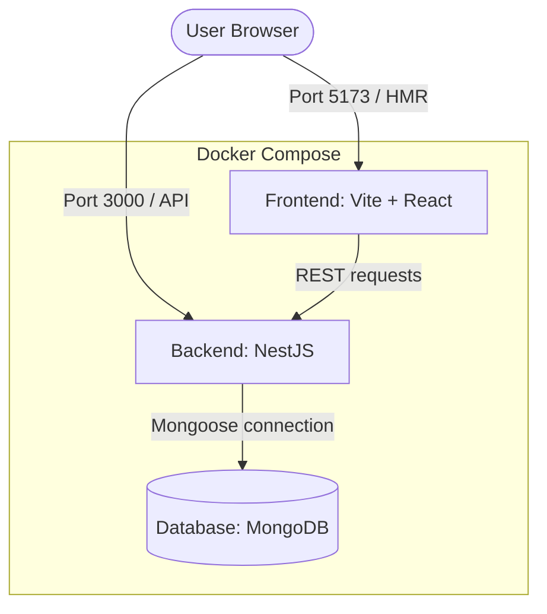

# Implementation Plan - NotebookLM Clone for Studying

Build a full-stack, dockerized development blueprint for a NotebookLM clone with MongoDB, a NestJS API backend, and a React + Vite + Tailwind CSS frontend. Both frontend and backend will support hot-reloading in Docker containers.

## User Review Required

> [!IMPORTANT]
> - **Hot Reloading Strategy**: Vite HMR inside Docker requires setting the Vite dev server to bind to host `0.0.0.0` and using `server.watch.usePolling = true` to capture filesystem events on macOS hosts.
> - **Polymorphic Sticky Notes**: Sticky notes will support three structures: Standard Text, Bulleted List, and Interactive Checklist (with checkboxes). We will design a polymorphic Mongoose Schema to handle this on the backend and implement immediate database persistence when check items are checked/unchecked in the UI.
> - **Mock File Uploads**: For sources, since we are not implementing a cloud bucket or local FS storage logic yet, the "Upload" action will allow users to input metadata (Title, Type, and a URL or dummy text content) and save this configuration to MongoDB.

## Proposed Architecture

---

## Proposed Changes

### Docker Configuration (Root)

#### [NEW] [docker-compose.yml](file:///Users/sahasrangshuguha/Work/PROJECTS/lets-geek/docker-compose.yml)
- Define `frontend`, `backend`, and `db` services.
- Map host directory `./frontend` to container `/app` and `./backend` to container `/app`.
- Mount separate anonymous volumes for `/app/node_modules` in both services to prevent host overrides.
- Connect services under a private network `notebook-network`.

---

### Backend (NestJS + MongoDB)

We will bootstrap a NestJS app in `./backend` and create modules for:
1. **Database**: Configuration of `@nestjs/mongoose` using standard env vars.
2. **Sources**: Metadata schema, CRUD endpoints, and pre-seeded mock contents.
3. **Notes**: Polymorphic schema supporting Text, Bullet List, and Checklist types with CRUD.
4. **Chat**: POST `/api/chat` returning mock responses grounded in active sources.

#### [NEW] [Dockerfile](file:///Users/sahasrangshuguha/Work/PROJECTS/lets-geek/backend/Dockerfile)
- Multi-stage Node Alpine build.
- Install dependencies, copy source files, run in dev mode (`npm run start:dev`).

#### [NEW] Schemas & DTOs
- `source.schema.ts`: Defines `title`, `type` (PDF, Doc, Audio, Video, URL), `url`, `content` (mock text).
- `note.schema.ts`: Polymorphic document schema with fields `title`, `type` ('text', 'list', 'checklist'), `content` (string), `listContent` (string array), and `checklistContent` (array of objects with `text` and `checked`).

---

### Frontend (React + TS + Tailwind + Vite)

We will bootstrap a Vite React TypeScript app in `./frontend` and configure:
1. **Tailwind CSS**: Dark-themed palette, fonts, styling utilities.
2. **Components**:
   - `Sidebar` / `LeftPanel`: Source creation, Category view switcher, List/Grid toggle, dot menu (Preview vs Open Tab).
   - `PreviewPane` / `Drawer`: Inside-app sliding preview window showing the full text contents of the selected source.
   - `ChatArea` / `MiddlePanel`: Message bubbles (user vs assistant), input footer, source citation indicators.
   - `Workspace` / `RightPanel`: Grid of sticky notes. Adding, deleting, editing notes.
   - `NoteCard`: Renders notes appropriately (Text, list, checkboxes) and handles direct toggling of checkboxes with immediate API sync.
   - `NoteModal`: Unified form to Create or Update a note, updating fields dynamically based on Note Type.

#### [NEW] [Dockerfile](file:///Users/sahasrangshuguha/Work/PROJECTS/lets-geek/frontend/Dockerfile)
- Node Alpine base image.
- Expose port 5173.
- Runs `npm run dev` with host configuration.

#### [NEW] [vite.config.ts](file:///Users/sahasrangshuguha/Work/PROJECTS/lets-geek/frontend/vite.config.ts)
- Configure `server.host = '0.0.0.0'` and `server.watch.usePolling = true` for reliable hot-reloading inside the Docker container on Mac OS.

---

## Verification Plan

### Automated Tests
- We will verify that NestJS compiles successfully and runs.
- We will verify that Vite builds and compiles TS without issues.

### Manual Verification
1. Run `docker-compose up --build` and verify that all 3 services (`frontend`, `backend`, `db`) launch and connect.
2. Navigate to `http://localhost:5173` to verify the dashboard layout.
3. Test Source Management: Add a source, verify List/Grid view toggles, open in New Tab or Preview Split-Pane.
4. Test Chat Interface: Type a message, verify it shows in chat history and the backend returns a successful mock response.
5. Test Sticky Notes Workspace:
   - Create a Text Note, List Note, and Checklist Note.
   - Edit a note's title and contents.
   - Check/uncheck a checkbox inside a Checklist Note and reload the page to verify persistent status.
   - Delete a note and ensure it disappears instantly.
6. Verify Hot Reloading: Make a minor CSS or text change in both frontend and backend source files and confirm that updates reflect immediately without restarting Docker.
